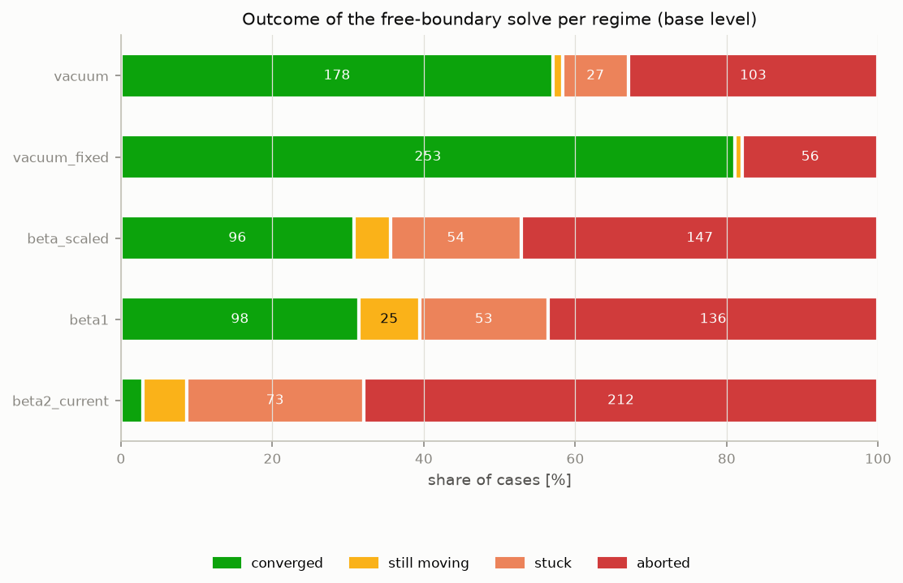
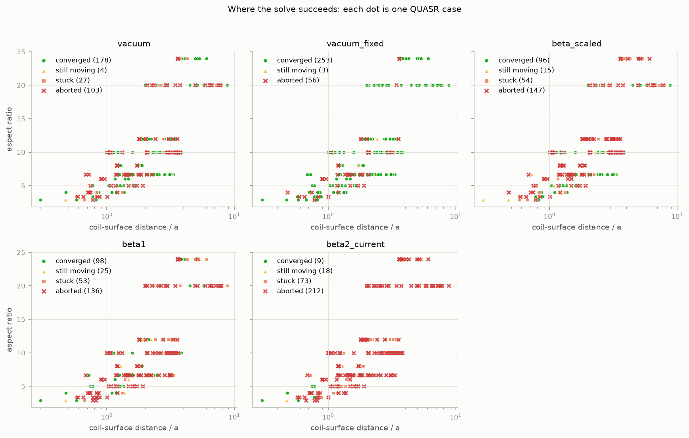
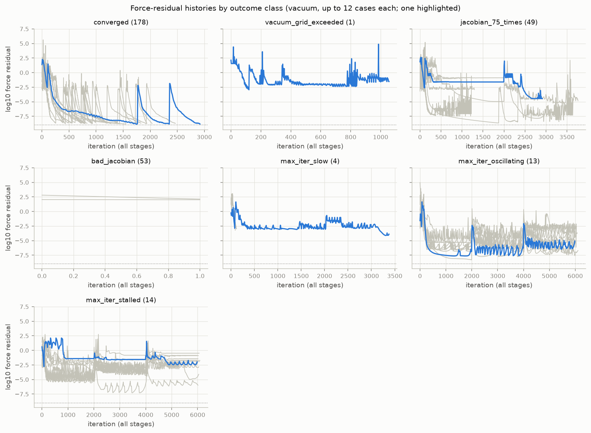
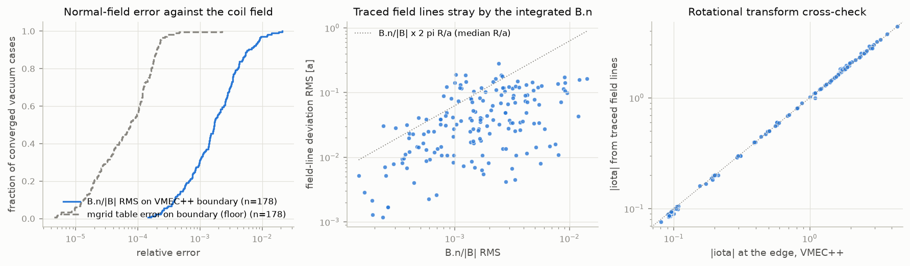
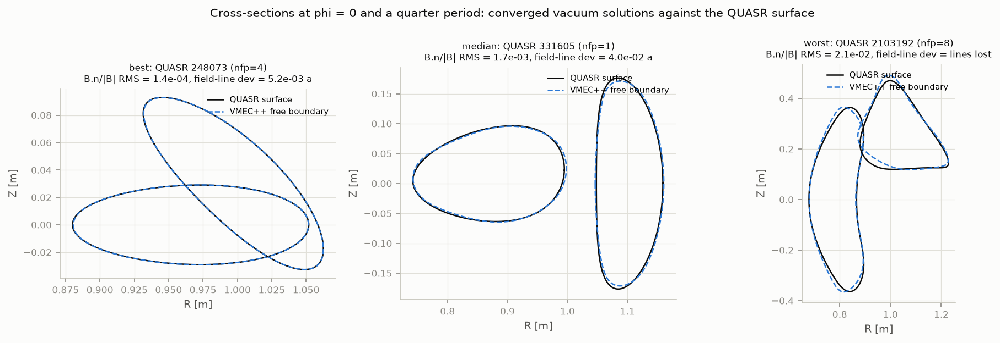
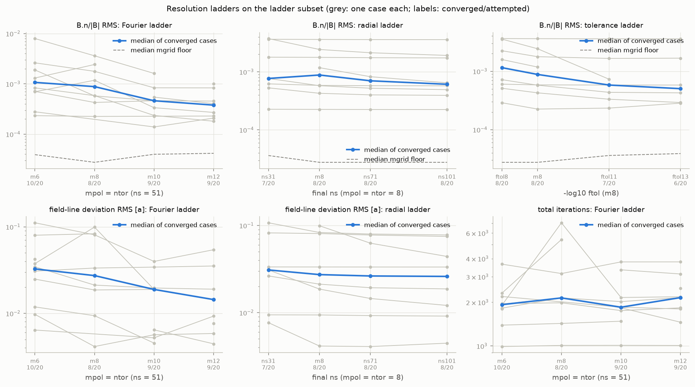
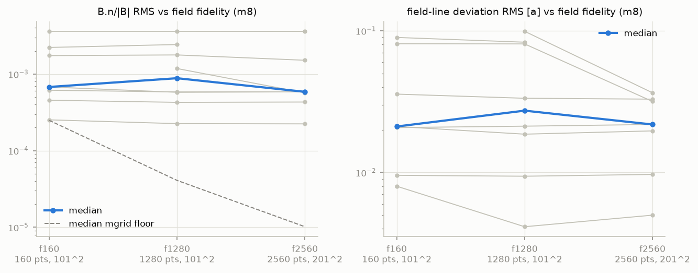
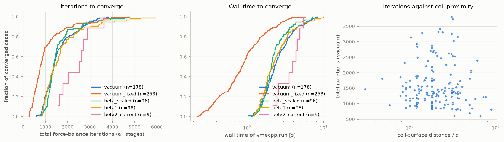
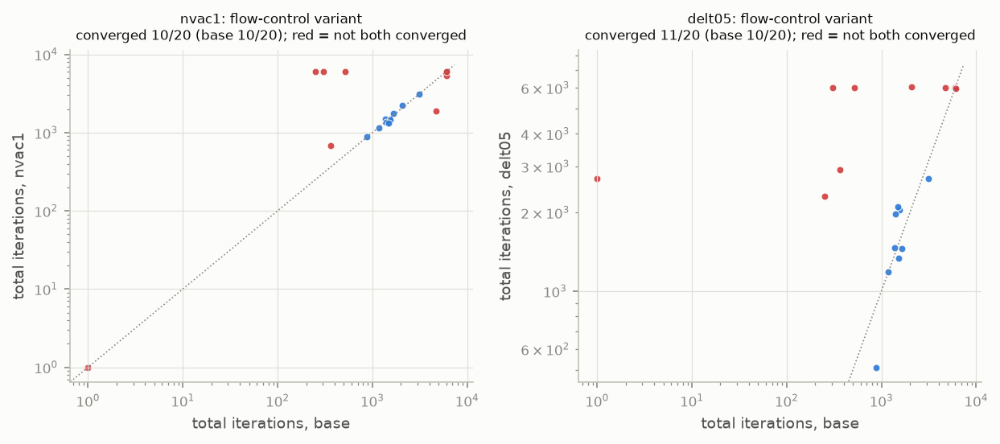

# VMEC++ free-boundary bench: results

Generated from the ledgers `benchmarks/free_boundary/results/main`, `benchmarks/free_boundary/results/ladder`, `benchmarks/free_boundary/results/badjac`, `benchmarks/free_boundary/results/condensed`.

## Setup

* Solver: VMEC++ package version 0.7.4.dev33+g91ab6b351 (per-record versions where recorded: ['0.7.4.dev33+g91ab6b351']); SIMSOPT 1.11.1, Python 3.14.5, macOS-26.5-arm64-arm-64bit-Mach-O.
* Cases: 312 QUASR configurations from the manifest (12 reference, 300 stratified), 20 on the ladders.
* Runs in the ledger: 2048 across regimes ['beta1', 'beta2_current', 'beta_scaled', 'vacuum', 'vacuum_fixed'], levels ['base', 'base_cond', 'delt05', 'ftol11', 'ftol13', 'ftol8', 'm10', 'm12', 'm6', 'm8', 'ns101', 'ns31', 'ns71', 'nvac1'], field specs ['f1280', 'f1280w', 'f160', 'f2560'].
* Field-line tracing in the records: [50, 100] toroidal turns (the value stored with each record is the one used).
* `main`: started 2026-09-02 09:15:25, last finished 2026-09-02 14:06:59, workers x threads = 3 x 3, VMEC++ package 0.7.4.dev33+g91ab6b351 (recorded after the run; the installed package was built once, before any run, from this commit and not rebuilt).
* `ladder`: started 2026-09-02 14:07:05, last finished 2026-09-03 07:26:28, workers x threads = 1 x 3, VMEC++ package 0.7.4.dev33+g91ab6b351 (recorded after the run; the installed package was built once, before any run, from this commit and not rebuilt).
* `badjac`: started 2026-09-02 17:22:52, last finished 2026-09-02 18:04:56, workers x threads = 3 x 3, VMEC++ package 0.7.4.dev33+g91ab6b351 (recorded after the run; the installed package was built once, before any run, from this commit and not rebuilt).
* `condensed`: started 2026-09-03 08:07:31, last finished 2026-09-03 09:55:00, workers x threads = 3 x 3, VMEC++ package 0.7.4.dev33+g91ab6b351.

Regimes: `vacuum`: zero pressure, zero net toroidal current; `beta1`: about 1 percent volume-averaged beta, no current; `beta2_current`: about 2 percent beta plus a net toroidal current; `vacuum_fixed`: vacuum, fixed boundary on the truncated QUASR surface (control); `beta_scaled`: beta scaled per case to a nominal Shafranov shift of 0.2 a.

Levels: `base`: mpol=ntor=6, ns=[8, 16, 31], nzeta=24, ftol=1e-09, niter=2000, nvacskip=6, delt=1.0; `m6`: mpol=ntor=6, ns=[8, 16, 31, 51], nzeta=24, ftol=1e-09, niter=2000, nvacskip=6, delt=1.0; `m8`: mpol=ntor=8, ns=[8, 16, 31, 51], nzeta=32, ftol=1e-09, niter=2000, nvacskip=6, delt=1.0; `m10`: mpol=ntor=10, ns=[8, 16, 31, 51], nzeta=40, ftol=1e-09, niter=2000, nvacskip=6, delt=1.0; `m12`: mpol=ntor=12, ns=[8, 16, 31, 51], nzeta=48, ftol=1e-09, niter=2000, nvacskip=6, delt=1.0; `ns31`: mpol=ntor=8, ns=[8, 16, 31], nzeta=32, ftol=1e-09, niter=2000, nvacskip=6, delt=1.0; `ns71`: mpol=ntor=8, ns=[8, 16, 31, 51, 71], nzeta=32, ftol=1e-09, niter=2000, nvacskip=6, delt=1.0; `ns101`: mpol=ntor=8, ns=[8, 16, 31, 51, 71, 101], nzeta=32, ftol=1e-09, niter=2000, nvacskip=6, delt=1.0; `ftol8`: mpol=ntor=8, ns=[8, 16, 31, 51], nzeta=32, ftol=1e-08, niter=2000, nvacskip=6, delt=1.0; `ftol11`: mpol=ntor=8, ns=[8, 16, 31, 51], nzeta=32, ftol=1e-11, niter=4000, nvacskip=6, delt=1.0; `ftol13`: mpol=ntor=8, ns=[8, 16, 31, 51], nzeta=32, ftol=1e-13, niter=8000, nvacskip=6, delt=1.0; `nvac1`: mpol=ntor=6, ns=[8, 16, 31], nzeta=24, ftol=1e-09, niter=2000, nvacskip=1, delt=1.0; `delt05`: mpol=ntor=6, ns=[8, 16, 31], nzeta=24, ftol=1e-09, niter=2000, nvacskip=6, delt=0.5; `base_cond`: mpol=ntor=6, ns=[8, 16, 31], nzeta=24, ftol=1e-09, niter=2000, nvacskip=6, delt=1.0.

Field specs: `f160`: 160-point coil polygons, 101^2 R-Z grid, margin 0.4; `f1280`: 1280-point coil polygons, 101^2 R-Z grid, margin 0.4; `f1280w`: 1280-point coil polygons, 121^2 R-Z grid, margin 1.0; `f2560`: 2560-point coil polygons, 201^2 R-Z grid, margin 0.4.

## Robustness

Outcome classes per regime at the base level (count and share of cases):

| class | meaning | vacuum | vacuum_fixed | beta_scaled | beta1 | beta2_current |
|---|---|---|---|---|---|---|
| converged | all three force residuals below ftol at the final ns | 178 (57%) | 253 (81%) | 96 (31%) | 98 (31%) | 9 (3%) |
| vacuum_grid_exceeded | the boundary left the mgrid box (field clamped, run aborted) | 1 (0%) | 0 (0%) | 3 (1%) | 16 (5%) | 69 (22%) |
| jacobian_75_times | flux surfaces kept self-intersecting (Jacobian reset 75 times) | 49 (16%) | 2 (1%) | 70 (22%) | 64 (21%) | 81 (26%) |
| bad_jacobian | initial Jacobian bad even after the ns = 3 retry | 53 (17%) | 54 (17%) | 74 (24%) | 56 (18%) | 62 (20%) |
| max_iter_near | budget exhausted within a decade of ftol | 0 (0%) | 3 (1%) | 5 (2%) | 7 (2%) | 1 (0%) |
| max_iter_slow | budget exhausted while still converging (would reach ftol within 3x budget) | 4 (1%) | 0 (0%) | 10 (3%) | 18 (6%) | 17 (5%) |
| max_iter_oscillating | budget exhausted with the residual oscillating | 13 (4%) | 0 (0%) | 27 (9%) | 29 (9%) | 23 (7%) |
| max_iter_stalled | budget exhausted on a residual plateau | 14 (4%) | 0 (0%) | 27 (9%) | 24 (8%) | 50 (16%) |
| total |  | 312 | 312 | 312 | 312 | 312 |

Convergence rate by coil-to-surface distance (in minor radii, terciles of the QUASR index):

| coil distance | vacuum | vacuum_fixed | beta_scaled | beta1 | beta2_current |
|---|---|---|---|---|---|
| far (>1.9 a) | 84/145 (58%) | 129/145 (89%) | 54/145 (37%) | 29/145 (20%) | 1/145 (1%) |
| mid (1.2-1.9 a) | 59/93 (63%) | 71/93 (76%) | 22/93 (24%) | 38/93 (41%) | 2/93 (2%) |
| near (<1.2 a) | 35/74 (47%) | 53/74 (72%) | 20/74 (27%) | 31/74 (42%) | 6/74 (8%) |

By number of field periods:

| nfp | vacuum | vacuum_fixed | beta_scaled | beta1 | beta2_current |
|---|---|---|---|---|---|
| 1 | 20/57 (35%) | 55/57 (96%) | 18/57 (32%) | 11/57 (19%) | 1/57 (2%) |
| 2 | 44/70 (63%) | 59/70 (84%) | 43/70 (61%) | 16/70 (23%) | 2/70 (3%) |
| 3 | 38/57 (67%) | 44/57 (77%) | 13/57 (23%) | 5/57 (9%) | 1/57 (2%) |
| 4 | 35/56 (62%) | 45/56 (80%) | 15/56 (27%) | 23/56 (41%) | 2/56 (4%) |
| 5 | 21/37 (57%) | 27/37 (73%) | 7/37 (19%) | 23/37 (62%) | 3/37 (8%) |
| 6 | 7/16 (44%) | 8/16 (50%) | 0/16 (0%) | 7/16 (44%) | 0/16 (0%) |
| 7 | 9/14 (64%) | 10/14 (71%) | 0/14 (0%) | 10/14 (71%) | 0/14 (0%) |
| 8 | 4/5 (80%) | 5/5 (100%) | 0/5 (0%) | 3/5 (60%) | 0/5 (0%) |

By mean rotational transform:

| iota | vacuum | vacuum_fixed | beta_scaled | beta1 | beta2_current |
|---|---|---|---|---|---|
| 0.25-0.75 | 41/94 (44%) | 75/94 (80%) | 33/94 (35%) | 34/94 (36%) | 6/94 (6%) |
| > 0.75 | 94/152 (62%) | 118/152 (78%) | 20/152 (13%) | 64/152 (42%) | 1/152 (1%) |
| iota <= 0.25 | 43/66 (65%) | 60/66 (91%) | 43/66 (65%) | 0/66 (0%) | 2/66 (3%) |

Fixed-boundary control: the same case with the QUASR surface imposed. A free-boundary failure whose fixed-boundary twin also fails is a boundary-representation or initial-guess problem, not a free-boundary one.

| free-boundary class | cases | fixed-boundary converged | fixed-boundary bad_jacobian | fixed-boundary other failure |
|---|---|---|---|---|
| converged | 178 | 176 | 1 | 1 |
| vacuum_grid_exceeded | 1 | 1 | 0 | 0 |
| jacobian_75_times | 49 | 45 | 0 | 4 |
| bad_jacobian | 53 | 0 | 53 | 0 |
| max_iter_slow | 4 | 4 | 0 | 0 |
| max_iter_oscillating | 13 | 13 | 0 | 0 |
| max_iter_stalled | 14 | 14 | 0 | 0 |

Initial-Jacobian failures rerun at higher Fourier resolution (m8, m10: ns = 51) and with a spectrally condensed initial boundary (base_cond):

| level | what changes | cases rerun | free-boundary converged | still bad_jacobian | jacobian_75_times | other | fixed-boundary converged | B.n RMS median of converged | spectral width reduction (median) |
|---|---|---|---|---|---|---|---|---|---|
| m8 | Fourier ladder | 53 | 0 | 53 | 0 | 0 |  |  |  |
| m10 | Fourier ladder | 53 | 0 | 53 | 0 | 0 |  |  |  |
| base_cond | base with a spectrally condensed initial boundary | 53 | 10 | 39 | 2 | 2 | 14/53 | 0.00217 | 0.899 |

Base level against the condensed initial boundary on the cases run at both:

Cases run at both levels: 53. Converged at base: 0; with the condensed boundary: 10. Newly converging: 10; newly failing: 0.

Status transitions (rows: base, columns: condensed):

| status | bad_jacobian | converged | jacobian_75_times | max_iter_stalled |
|---|---|---|---|---|
| bad_jacobian | 39 | 10 | 2 | 2 |

Non-converged vacuum runs at the base level, up to four per class (the full list is in `failures_vacuum.csv`):

| case | nfp | coil dist / a | aspect | iota | max elong. | class | ns reached | iterations | fsqr | fsqz | Jacobian resets | delt resets | message |
|---|---|---|---|---|---|---|---|---|---|---|---|---|---|
| 14802 | 2 | 1.21 | 4 | 0.5 | 5.77 | bad_jacobian | 8 | 0 | 1 | 1 | 0 | 0 |  |
| 17263 | 2 | 2.05 | 10 | 0.8 | 4.82 | bad_jacobian | 8 | 0 | 1 | 1 | 0 | 0 |  |
| 25455 | 2 | 1.91 | 5 | 0.6 | 7.06 | bad_jacobian | 8 | 1 | 5.33e+06 | 1.37e+03 | 0 | 0 |  |
| 69266 | 4 | 2.05 | 10 | 0.4 | 4.06 | bad_jacobian | 8 | 1 | 839 | 3.88e+03 | 0 | 0 |  |
| 19493 | 2 | 0.88 | 3.33 | 0.1 | 1.91 | jacobian_75_times | 8 | 249 | 1.64 | 3.04 | 74 | 2 |  |
| 19609 | 2 | 2.26 | 6.67 | 0.1 | 2.67 | jacobian_75_times | 8 | 306 | 0.00391 | 0.00999 | 36 | 2 |  |
| 50136 | 3 | 1.44 | 6.67 | 0.1 | 3.16 | jacobian_75_times | 8 | 363 | 0.00218 | 0.00514 | 71 | 2 |  |
| 123355 | 1 | 1.05 | 10 | 0.2 | 4.4 | jacobian_75_times | 8 | 816 | 2.33e-07 | 4.73e-08 | 2 | 2 |  |
| 108654 | 1 | 7.2 | 20 | 0.6 | 9.49 | max_iter_oscillating | 31 | 6082 | 0.000234 | 8.98e-05 | 7 | 3 |  |
| 112718 | 1 | 1.32 | 4 | 0.1 | 3.12 | max_iter_oscillating | 31 | 6000 | 7.25e-06 | 1.52e-06 | 5 | 0 |  |
| 123354 | 1 | 2.56 | 20 | 0.2 | 2.32 | max_iter_oscillating | 8 | 8 | 2.85 | 3.59 | 0 | 0 |  |
| 126505 | 1 | 3.41 | 10 | 0.5 | 5.77 | max_iter_oscillating | 31 | 6000 | 0.000692 | 0.000606 | 5 | 0 |  |
| 219699 | 3 | 0.719 | 4 | 0.2 | 3.18 | max_iter_slow | 8 | 118 | 0.000573 | 0.000395 | 13 | 0 |  |
| 819202 | 4 | 0.473 | 2.86 | 0.1 | 3.34 | max_iter_slow | 8 | 114 | 0.00064 | 0.000356 | 13 | 0 |  |
| 1572277 | 5 | 3.6 | 24 | 1.9 | 7.27 | max_iter_slow | 16 | 3383 | 7.05e-05 | 0.00167 | 7 | 1 |  |
| 2083582 | 6 | 0.9 | 6 | 2.9 | 6.08 | max_iter_slow | 8 | 91 | 0.000215 | 0.000371 | 4 | 0 |  |
| 23786 | 2 | 6.49 | 20 | 0.5 | 6.67 | max_iter_stalled | 31 | 6027 | 0.0202 | 0.0169 | 9 | 1 |  |
| 105337 | 1 | 3.37 | 10 | 0.3 | 9.92 | max_iter_stalled | 31 | 6054 | 0.00121 | 0.000875 | 3 | 2 |  |
| 133413 | 1 | 6.44 | 20 | 0.3 | 3.44 | max_iter_stalled | 31 | 6083 | 0.0067 | 0.00538 | 3 | 3 |  |
| 134722 | 1 | 7.88 | 20 | 0.4 | 3.83 | max_iter_stalled | 31 | 6000 | 0.0525 | 0.0755 | 12 | 0 |  |
| 234994 | 4 | 0.708 | 4 | 0.2 | 2.24 | vacuum_grid_exceeded | 8 | 1057 | 0.0119 | 0.0136 | 35 | 2 |  |

## Accuracy (vacuum, converged, base level)

All errors are relative to the exact Biot-Savart field of the coils, evaluated on the VMEC++ boundary. Distances are in minor radii. The floor is the error of the mgrid table itself on the boundary; a solver cannot beat it.

| metric | n | median | p90 | max |
|---|---|---|---|---|
| B.n/\|B\| RMS | 178 | 0.00169 | 0.00582 | 0.0212 |
| B.n/\|B\| max | 178 | 0.00743 | 0.027 | 0.0903 |
| field-line deviation RMS [a] | 171 | 0.0345 | 0.131 | 0.284 |
| field-line deviation max [a] | 171 | 0.0985 | 0.371 | 0.496 |
| fraction of traced lines lost | 178 | 0 | 0.5 | 1 |
| \|B\|^2 mismatch RMS | 178 | 0.00175 | 0.0067 | 0.0382 |
| distance to QUASR surface RMS [a] | 178 | 0.0222 | 0.095 | 0.24 |
| distance to QUASR surface max [a] | 178 | 0.0722 | 0.333 | 0.878 |
| volume / QUASR volume | 178 | 1 | 1 | 1.14 |
| delbsq (VMEC++ edge \|B\|^2 mismatch) | 178 | 0.00136 | 0.00452 | 0.0228 |
| mgrid table error on boundary RMS (floor) | 178 | 7.6e-05 | 0.0002 | 0.00226 |
| mgrid table error on boundary max | 178 | 0.000256 | 0.000639 | 0.0123 |
| ground-truth self-check (max rel.) | 178 | 3.43e-15 | 1.94e-11 | 0.0117 |
| B.n RMS / floor | 178 | 25.7 | 63.3 | 200 |
| fraction of lines lost from the QUASR surface itself (computed for the cases with lost lines) | 28 | 1 | 1 | 1 |
| edge iota: \|VMEC++ - QUASR\| / \|QUASR\| | 178 | 0.00838 | 0.0472 | 0.182 |
| edge iota: \|traced - VMEC++\| / \|VMEC++\| | 171 | 0.00791 | 0.0468 | 0.0958 |

28 of the 178 converged vacuum cases lose at least one of the traced field lines (19 lose half or more). Of the 28 checked, the same tracing started on the QUASR surface itself loses lines in 26: there the coil field's last closed flux surface lies inside the QUASR boundary and the lost lines say nothing about the solver.

## Convergence with resolution (ladder subset, vacuum)

| level | mpol | ns | ftol | converged | B.n RMS median | floor median | fl dev RMS median [a] | iterations median | wall time median [s] | ms / iteration median |
|---|---|---|---|---|---|---|---|---|---|---|
| base | 6 | 31 | 1e-09 | 10/20 | 0.00112 | 3.92e-05 | 0.0346 | 1.5e+03 | 2.22 | 1.56 |
| m6 | 6 | 51 | 1e-09 | 10/20 | 0.00107 | 3.92e-05 | 0.0326 | 1.93e+03 | 5.56 | 2.91 |
| m8 | 8 | 51 | 1e-09 | 8/20 | 0.000881 | 2.76e-05 | 0.0273 | 2.14e+03 | 12.3 | 5.14 |
| m10 | 10 | 51 | 1e-09 | 9/20 | 0.000462 | 3.99e-05 | 0.0189 | 1.85e+03 | 18 | 8.43 |
| m12 | 12 | 51 | 1e-09 | 9/20 | 0.000378 | 4.17e-05 | 0.0144 | 2.16e+03 | 36.3 | 16.6 |
| ns31 | 8 | 31 | 1e-09 | 7/20 | 0.000769 | 3.62e-05 | 0.0309 | 1.5e+03 | 6.47 | 4.54 |
| ns71 | 8 | 71 | 1e-09 | 8/20 | 0.0007 | 2.76e-05 | 0.0263 | 2.52e+03 | 13.4 | 5.35 |
| ns101 | 8 | 101 | 1e-09 | 8/20 | 0.00061 | 2.76e-05 | 0.026 | 2.96e+03 | 19.1 | 6.19 |
| ftol8 | 8 | 51 | 1e-08 | 8/20 | 0.00115 | 2.76e-05 | 0.0344 | 1.55e+03 | 9.48 | 5.41 |
| ftol11 | 8 | 51 | 1e-11 | 7/20 | 0.00058 | 3.62e-05 | 0.0125 | 4.84e+03 | 22.9 | 5.5 |
| ftol13 | 8 | 51 | 1e-13 | 6/20 | 0.000503 | 3.9e-05 | 0.00845 | 7.96e+03 | 40.7 | 4.93 |
| nvac1 | 6 | 31 | 1e-09 | 10/20 | 0.000941 | 3.92e-05 | 0.0371 | 1.48e+03 | 6.01 | 4.16 |
| delt05 | 6 | 31 | 1e-09 | 11/20 | 0.00188 | 4.27e-05 | 0.016 | 1.97e+03 | 4.67 | 2.76 |

Same ladders restricted to the cases that converged at every level (like against like):

| ladder | level | cases converged at every level | B.n RMS median | B.n RMS max | fl dev RMS median [a] | iterations median |
|---|---|---|---|---|---|---|
| Fourier (ns = 51) | m6 | 6 | 0.00077 | 0.00262 | 0.0326 | 1.93e+03 |
| Fourier (ns = 51) | m8 | 6 | 0.000581 | 0.00177 | 0.0273 | 2.14e+03 |
| Fourier (ns = 51) | m10 | 6 | 0.000399 | 0.000836 | 0.0193 | 1.93e+03 |
| Fourier (ns = 51) | m12 | 6 | 0.000325 | 0.000831 | 0.0167 | 1.99e+03 |
| radial (mpol = 8) | ns31 | 7 | 0.000769 | 0.00374 | 0.0309 | 1.5e+03 |
| radial (mpol = 8) | m8 | 7 | 0.000584 | 0.00361 | 0.0212 | 2.14e+03 |
| radial (mpol = 8) | ns71 | 7 | 0.000577 | 0.00359 | 0.0193 | 2.37e+03 |
| radial (mpol = 8) | ns101 | 7 | 0.000574 | 0.00358 | 0.0187 | 2.67e+03 |
| tolerance (m8) | ftol8 | 6 | 0.000659 | 0.00363 | 0.0316 | 1.44e+03 |
| tolerance (m8) | m8 | 6 | 0.000581 | 0.00361 | 0.0199 | 2.06e+03 |
| tolerance (m8) | ftol11 | 6 | 0.000508 | 0.00359 | 0.0108 | 4.16e+03 |
| tolerance (m8) | ftol13 | 6 | 0.000503 | 0.0036 | 0.00845 | 7.96e+03 |

## Speed (converged runs, base level)

Wall times are laptop timings with three threads per run and three runs at a time; ledgers were produced under different background load, so iteration counts are the portable number and wall times are indicative within one ledger only.

| regime | converged | iterations median | iterations p90 | wall time median [s] | wall time p90 [s] | ms / iteration median | vacuum switched on at iteration (median) | bad-Jacobian restarts (median) | mgrid build median [s] |
|---|---|---|---|---|---|---|---|---|---|
| vacuum | 178 | 1.37e+03 | 2.66e+03 | 2.28 | 4.58 | 1.6 | 63.5 | 4 | 28.9 |
| vacuum_fixed | 253 | 761 | 2.19e+03 | 0.854 | 2.37 | 0.953 |  | 1 | 29.5 |
| beta_scaled | 96 | 1.36e+03 | 2.6e+03 | 2.06 | 3.68 | 1.51 | 59.5 | 3 | 25.6 |
| beta1 | 98 | 1.39e+03 | 2.83e+03 | 2.16 | 4.54 | 1.52 | 69 | 4 | 42.2 |
| beta2_current | 9 | 2.52e+03 | 3.03e+03 | 3.92 | 4.99 | 1.52 | 95 | 4 | 19.7 |

## Finite beta

Beta regimes have no exact ground truth (plasma currents contribute to the field), so only convergence and sanity are reported: the achieved beta, the outboard shift of the magnetic axis against the vacuum solution of the same case, and for the current-carrying regime the net toroidal current.

| regime | converged | target beta median (all cases) | target beta median (converged) | achieved / target beta (median) | axis shift / a vs vacuum (median) | outboard shift in | runs aborted by grid overrun | runs aborted by Jacobian | ctor / prescribed (median) |
|---|---|---|---|---|---|---|---|---|---|
| beta_scaled | 96/312 | 0.0247 | 0.00354 | 1.03 | 0.196 | 93/93 | 3 | 70 |  |
| beta1 | 98/312 | 0.01 | 0.01 | 1.01 | 0.0836 | 74/89 | 16 | 64 |  |
| beta2_current | 9/312 | 0.02 | 0.02 | 1.01 | 0.844 | 7/7 | 69 | 81 | 1 |

## Ledger columns

Every run is one JSON record in `results.jsonl`; see `README.md` for the definition of the metrics and `classify.py` for the classes.
